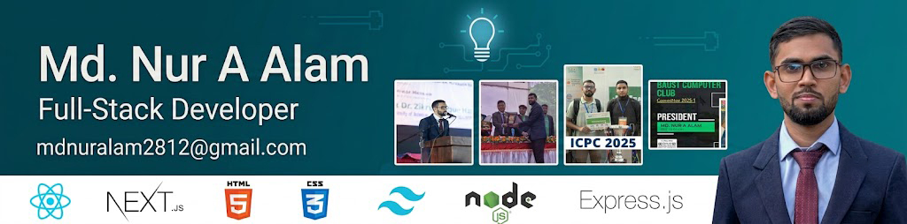

  

<h1 align="center">Hi 👋, I'm Md. Nur A Alam</h1>
<h3 align="center">Full-Stack MERN Developer | Competitive Programmer | 2x IEEE Published Author</h3>

  

  <i>"Fix the cause, not the symptom."</i>

---

<table>
  <tr>
    <td width="30%" align="center" valign="middle">
      
    </td>
    <td width="70%" valign="top">
      <h3>🚀 About Me</h3>
      
I am a passionate <b>Full-Stack Developer</b> specializing in crafting clean, high-performance web applications using the MERN stack and Next.js. I have a strong background in competitive programming and academic research, with a keen focus on solving complex algorithmic problems.

      <ul>
        <li>🎓 <b>CS Graduate</b> from Bangladesh Army University of Science and Technology (BAUST), Class of 2025.</li>
        <li>💻 <b>President</b> of BAUST Computer Club (Committee 2025), leading tech initiatives, workshops, and coding contests.</li>
        <li>🏆 <b>Competitive Programmer</b>: ICPC Dhaka Regional participant (ICPC 2025). Active on Codeforces, LeetCode, and HackerRank.</li>
        <li>📝 <b>2x IEEE Published Author</b>, working on machine learning and intelligent automated systems.</li>
        <li>🌐 All projects & live demos are hosted at <a href="https://md-nur-a-alam-portfolio.vercel.app">md-nur-a-alam-portfolio.vercel.app</a>.</li>
        <li>📍 Based in <b>Dhaka, Bangladesh</b>.</li>
      </ul>
    </td>
  </tr>
</table>

---

### 🛠️ Languages & Tech Stack

<table>
  <tr>
    <td valign="top" width="50%">
      <h4>💻 Frontend Development</h4>
      
      
      
      
      
      
      
    </td>
    <td valign="top" width="50%">
      <h4>⚙️ Backend & Databases</h4>
      
      
      
      
      
      
    </td>
  </tr>
  <tr>
    <td valign="top" width="50%">
      <h4>📚 Core Programming Languages</h4>
      
      
      
      
    </td>
    <td valign="top" width="50%">
      <h4>🧠 ML Research & Design Tools</h4>
      
      
      
      
      
      
      
      
    </td>
  </tr>
</table>

---

### 🌟 Featured Projects

- 🏡 **[DreamPlot](https://github.com/Md-Nur-A-Alam/Nur-PH13-A10-DreamPlot-Client)**: A robust, responsive real-estate/property booking portal built using the MERN Stack. Includes property search, booking checkout, administrative panel, dynamic statistics dashboards, and role-based authentication.
- ⚡ **[Keen Keeper](https://github.com/Md-Nur-A-Alam/Hero-B13-A07-keen_keeper)**: A responsive password management & secure notes-taking app created using React, featuring local encryption/hashing simulation, instant query search, and user-friendly category filters.
- 🚧 **[Intelligent Hazard Detection](https://github.com/Md-Nur-A-Alam/Intelligent-Hazard-Detection)**: A machine learning and computer vision framework using Jupyter Notebooks to parse real-time camera streams, isolate architectural and environmental anomalies, and generate predictive danger reports.
- 👥 **[AIUB HRMS](https://github.com/Md-Nur-A-Alam/AIUB_HRMS)**: A collaborative human resource dashboard supporting attendance logs, salary computations, structural role changes, and internal peer requests.

---

### 📊 GitHub Statistics & Metrics

  
  &nbsp;&nbsp;
  

  

---

### 🏆 Research & Competitive Programming

  
  
  
  

---

### 🤝 Connect With Me

  
  
  
  
  

